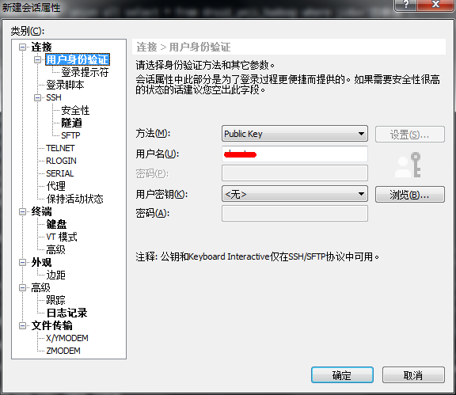
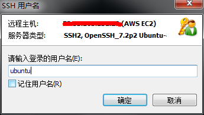

亚马逊AWS ES服务器有一年的免费使用优惠。注册后创建实例当做远程服务器使用相当方便。比较坑的是注册必须要有信用卡，过程有点麻烦。
<!-- more -->
官方给的说明里有SSH连接方式说明：
>使用 ssh 命令连接到实例。您可以指定私有密钥 (.pem) 文件和 user_name@public_dns_name。 对于 Amazon Linux，用户名为 ec2-user。对于 RHEL，用户名称是 ec2-user 或 root。对于 Ubuntu，用户名称是 ubuntu 或 root。对于 Centos，用户名称是 centos。对于 Fedora，用户名称是 ec2-user。对于 SUSE，用户名称是 ec2-user 或 root。另外，如果 ec2-user 和 root 无法使用，请与您的 AMI 供应商核实。

教程里介绍的是使用gitBash命令行工具来连接。但个人还是觉得Xshell用起来更方便，以下为配置Xshell登录AWS服务器的步骤，相当简单。

#### 步骤一：新建会话

填写名称并选择为SSH，填写 AWS EC 服务器对公IP，端口号默认22，然后修改用户身份验证

#### 步骤二：用户身份验证

选择左侧用户身份验证菜单，方法选择为public key, 用户名ubuntu（此处以ubuntu服务器为例），此项可后面步骤再填。然后点击【浏览】导入证书

#### 步骤三：导入证书

点击【导入】，选择创建服务器实例时下载的*.pem文件导入，左侧选中此文件点南【确定】，配置完成，可以登录

#### 步骤四：登录

登录时选择刚刚新建的会话，如果之前未输入用户名，则会提示输入用户名。点击【确定】，即可登录，如果已配置过用户，无需确认，直接登录成功

登录完成，可以愉快玩耍了！